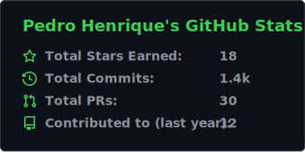
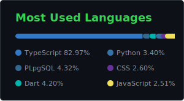

# Pedro Henrique Quadro de Almeida

## 👋 About

- 🤖 **AI Engineer** building automation and AI agents that turn business problems into shipped systems.
- ⚡ I live in **n8n, Supabase, React/TypeScript and Python**, wiring CRM and AI ecosystems that run in production.
- 🧩 Full stack by habit: from Postgres schemas, webhooks and integrations to front end and LLM orchestration.
- 🌎 Building in public and open to remote roles.

## 🧠 Automation & AI

  
  
  
  

## ⚙️ Stack & Data

  

## 📊 GitHub Stats

  
  

  

## 🐍 Contribution Snake

  <picture>
    <source media="(prefers-color-scheme: dark)" srcset="https://raw.githubusercontent.com/PedroHenrique0713/PedroHenrique0713/output/snake-dark.svg">
    <source media="(prefers-color-scheme: light)" srcset="https://raw.githubusercontent.com/PedroHenrique0713/PedroHenrique0713/output/snake.svg">
    
  </picture>

## 💬 Let's talk

Got an automation, an AI agent or a full stack build in mind? Let's connect.

