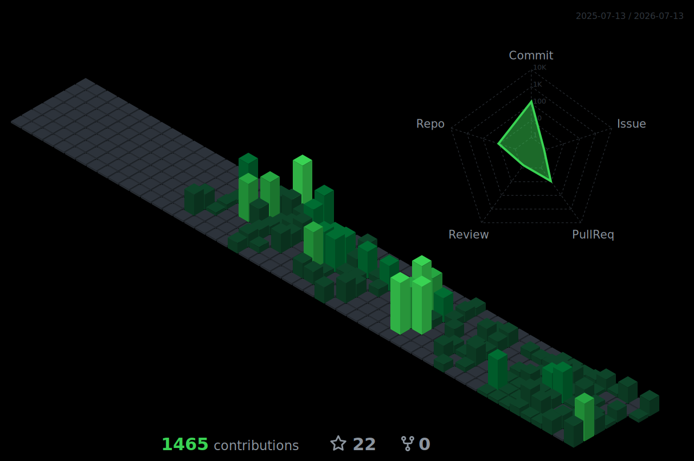

## 👋 About

- 🤖 **AI Engineer** turning business problems into shipped automation and AI agents.
- 🔭 Currently deep in **AI agents, CRM automation and LLM orchestration**.
- ⚡ Daily drivers: **n8n, Supabase, React/TypeScript and Python**, running in production.
- 🧩 Full stack by habit: from Postgres schemas, webhooks and integrations to front end.
- 🌎 Based in Brazil, building in public and always leveling up.

## 🧠 Automation & AI

  
  
  
  

## ⚙️ Tech Stack

  

## 📊 GitHub Stats

  
  

## 🧊 3D Contribution

  

## 💬 Let's talk

Got an automation, an AI agent or a full stack build in mind? Let's connect.

