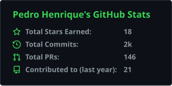
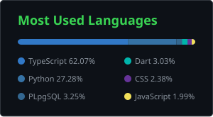

# Pedro Henrique

**AI Engineer** · Brazil

  

##  About

I build AI systems that run in production, not demos: LLM agents that handle 300+ leads a day, the server-side tracking that proves those leads converted, and the stack underneath — Postgres schemas, webhooks, auth and the front end.

Most of what I ship day to day is private code for enterprise clients, so this profile has two halves: the systems I built but can't open, and the work you can audit yourself.

##  Systems in production

**AI SDR agents · WhatsApp and Instagram** — qualification, meeting booking and direct CRM writes (Bitrix24, RD Station), handling 300+ leads a day. Meta delivers the same webhook two or more times in parallel, milliseconds apart, so deduplication has to be cross-execution rather than in-memory; conversations that leave the agent's scope are handed to a human instead of guessed at.

**Server-side conversion tracking** — Meta CAPI and Google Ads offline conversions fed from CRM stage changes, which brought back attribution for campaigns reporting zero conversions. The root cause is rarely the pixel: it is usually the funnel the form posts to versus the one the automation reads.

**Multi-tenant SaaS CRM · 862 commits, 20 active clients** — sole developer, end to end: PostgreSQL schema with row-level security and Edge Functions, WhatsApp Inbox on the official Cloud API, Kanban pipeline, dashboards, and a React/TypeScript/Vite front end with route-level code splitting.

**Authentication and social login** — Google, TikTok and Instagram on OIDC/OAuth 2.0, replacing Keycloak with an in-house JWT layer (access token plus rotating refresh in an httpOnly cookie) in a Next.js + MongoDB product.

**RAG agents with layered memory** — triage, FAQs and human handoff over an embedded knowledge base, cutting first-response time by 60%.

##  Open Source

Six patches merged upstream so far, in Supabase and QuestDB:

- [supabase/supabase-js](https://github.com/supabase/supabase-js): [encode broadcast header fields as UTF-8](https://github.com/supabase/supabase-js/pull/2516) · [match response Content-Type case-insensitively](https://github.com/supabase/supabase-js/pull/2515)
- [supabase/supabase](https://github.com/supabase/supabase): [Apple Services ID must be first in Client IDs for web sign-in](https://github.com/supabase/supabase/pull/47707)
- [questdb/documentation](https://github.com/questdb/documentation): [TTL on materialized views](https://github.com/questdb/documentation/pull/482) · [query.timeout duration key](https://github.com/questdb/documentation/pull/483) · [Parquet and CSV export in the Result Grid](https://github.com/questdb/documentation/pull/484)

The one I'd point at first is [supabase-js#2516](https://github.com/supabase/supabase-js/pull/2516): a UTF-8 byte-length mismatch was silently corrupting Realtime broadcast headers whenever a channel name carried an accent or an emoji. One side counted characters, the other counted bytes, so every test passed in plain English. Fixed with a regression test that failed before and passed after.

Open in review: [PKCE verifier](https://github.com/supabase/supabase-js/pull/2514), [storage metadata encoding](https://github.com/supabase/supabase-js/pull/2518), [postgrest filter escaping](https://github.com/supabase/supabase-js/pull/2529) and [rpc over POST](https://github.com/supabase/supabase-js/pull/2530) in supabase-js; [JSON.parse hardening across Studio](https://github.com/supabase/supabase/pull/48267); [null guards in postgres-meta](https://github.com/supabase/postgres-meta/pull/1091); [CSV quoting](https://github.com/calcom/cal.diy/pull/29783) and [lib hardening](https://github.com/calcom/cal.diy/pull/29820) in cal.diy; plus one each in [Appsmith](https://github.com/appsmithorg/appsmith/pull/42033), [ToolJet](https://github.com/ToolJet/ToolJet/pull/17269), [Infisical](https://github.com/Infisical/infisical/pull/7400) and [QuestDB docs](https://github.com/questdb/documentation/pull/477).

##  Products I built and run

- **[IdeiaTaker](https://app.ideiataker.space)** — meeting transcription and AI summaries for Google Meet with no bot in the call: it reads the native captions, so no extra participant joins and no audio is recorded. Chrome MV3, Next.js, Supabase, Groq and Gemini. In production.
- **[brain-template](https://github.com/PedroHenrique0713/brain-template)** — persistent, git-versioned memory for AI coding agents: semantic facts, session handoffs and skills in plain Markdown, shared across Claude Code, Gemini CLI and local models. No vendor database, no auto-compaction.
- **[claude-dongle](https://github.com/PedroHenrique0713/claude-dongle)** — usage-limit monitor for Claude Code: burn rate, overflow forecast and per-project consumption over the official OAuth usage API. Python, PyQt6.
- **BodyWay** — personal trainer app, Flutter + Supabase (RLS, 20 Edge Functions), live on [Google Play](https://play.google.com/store/apps/details?id=com.bodyway.app) and the [App Store](https://apps.apple.com/br/app/body-way/id6762882978).
- **[Cromo Certo](https://cromocerto.hypermind.space)** — freemium marketplace for World Cup 2026 sticker collectors: trades, auctions and on-device album scanning. React 19, Supabase, Turborepo.

##  Stack

  
  
  
  

##  Stats

  
  

##  Contact

Based in Brazil (UTC-3), working remotely with teams in the US and Europe. English: professional working proficiency.

Reach me on [LinkedIn](https://www.linkedin.com/in/pedrohenriquequadro) or by [email](mailto:pluspedrohenrique@gmail.com).
